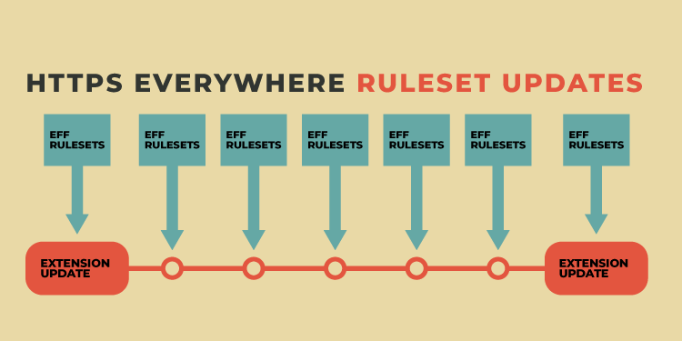
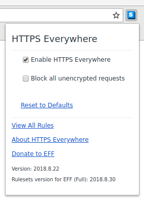
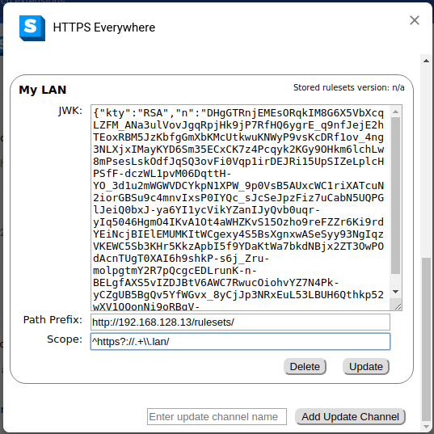
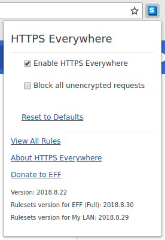

* [Ruleset Update Channels](#ruleset-update-channels)
  * [Update Channel Format & Logic](#update-channel-format--logic)
  * [Publishing Custom Update Channels](#publishing-custom-update-channels)
    * [1. Creating an RSA key and generating a `jwk` object from it](#1-creating-an-rsa-key-and-generating-a-jwk-object-from-it)
    * [2. Signing rulesets with this key](#2-signing-rulesets-with-this-key)
      * [Setup](#setup)
      * [Signing](#signing)
    * [3. Publishing those rulesets somewhere](#3-publishing-those-rulesets-somewhere)
    * [4. Getting users to use your update channel](#4-getting-users-to-use-your-update-channel)
  * [Adding and Deleting Update Channels](#adding-and-deleting-update-channels)

# Ruleset Update Channels

Whenever you download HTTPS Everywhere, it comes with a long list of *rulesets* that are maintained by the community.  These rulesets tell HTTPS Everywhere when and how to redirect requests to the secure version of a site.  HTTPS Everywhere includes tens of thousands of these rulesets, which are public and ever-changing as we expand and improve coverage.  They are delivered to you with each new version of the extension, along with all the code that makes up the extension itself.  Between and in addition to extension updates, code within the extension fetches regular updates to the rulesets.  This ensures that you get more up-to-date coverage for sites that offer HTTPS, and you'll encounter fewer sites that break due to bugs in our list of supported sites.



We deliver these rulesets via what we call an *update channel*.  Currently, HTTPS Everywhere is delivered with a single update channel, named `EFF (Full)`.  You can see this channel when you click on the HTTPS Everywhere icon and look at the bottom of the popup:



First, the extension version is shown (in this case 2018.8.22), and then the version of the rulesets for a given update channel is shown (in this case 2018.8.30).

## Update Channel Format & Logic

Update channels can be found in [`chromium/background-scripts/update_channels.js`](https://github.com/EFForg/https-everywhere/blob/master/chromium/background-scripts/update_channels.js), and consist of:

1. A `name` string, which identifies it and will be displayed in the extension popup
2. A `jwk` object, which defines the RSA public key to use when verifying downloaded rulesets
3. A `update_path_prefix` string, which tells the extension where to look for new rulesets
4. A `scope` string, which is used to construct a JavaScript `RegExp` object

Every 24 hours, the extension checks the URL contained in `update_path_prefix` appended with `/latest-rulesets-timestamp` (in the case of `EFF (Full)`, `https://www.https-rulesets.org/v1//latest-rulesets-timestamp`).  If it discovers the timestamp has updated since the last time it fetched the rulesets, it will download a new ruleset, following the format `update_path_prefix` appended with `default.rulesets.XXXXXXXXXX.gz`, where `XXXXXXXXXX` is the timestamp discovered in the previous request.

It then attempts to verify the rulesets, which are signed with the private RSA key corresponding to the public key in the update channel's `jwk` object.  If the signature verifies, the rulesets are stored and applied to the running instance of the extension.  If it can not be verified, the rulesets are discarded and the last known good state is used.

Once the rulesets are stored, they will be allowed to operate on URLs only within the `scope` of the update channel, as found above.  URLs must match the regular expression in this string in order to be redirected.  This string will be used as the first and only argument when constructing a JavaScript `RegExp` object.  If you wanted to define an update channel that only operated on URLs with the `www` subdomain, you could do so by entering the string `^https?://www\\.`, for example:

```javascript
> re = new RegExp('^https?://www\\.');
/^https?:\/\/www\./
> "http://www.example.com/".match(re);
[ 'http://www.',
  index: 0,
  input: 'http://www.example.com/',
  groups: undefined ]
> "http://example.com/".match(re);
null
```

## Publishing Custom Update Channels

In addition to the rulesets contained in the EFF update channel, you may want to publish your own.  There are a few instances where this may be useful:

1. You are on a corporate LAN and would rather not divulge the internal DNS records for various services by submitting rulesets to the public list
2. You are an organization that verifies `onion` services, and would like to create vanity URLs for the `onion` services that you've verified (this will make [usability of onion URLs](https://blog.torproject.org/cooking-onions-names-your-onions) much better)
3. You would like to implement tracker blocking within HTTPS Everywhere by forwarding a list of hosts to an unroutable address

There may be additional use cases not enumerated here.  For this to be effective, an organization has to publish their own custom update channel.  This involves a few steps:

1. Creating an RSA key and generating a `jwk` object from it
2. Signing rulesets with this key
3. Publishing those rulesets somewhere
4. Getting users to use your update channel

We will go through each of these in sequence, but first, you'll want to consider if you want your signing process airgapped or not.  Airgapped signing has the advantage of making it hard for malware to exfiltrate key material and thus forge a signed ruleset update, but it will also make it slightly more difficult to sign.  If you decide on an airgapped signing process, you may want to copy the script [`utils/sign-rulesets/async-airgap.sh`](https://github.com/EFForg/https-everywhere/blob/master/utils/sign-rulesets/async-airgap.sh) to the airgap *before* cutting off networking for the last time.  You may also want to install the `python-qr` code on this machine to easily copy the RSA public key to your development environment, once generated, as well as `qrencode` and `eog` for ease in the signing process.

### 1. Creating an RSA key and generating a `jwk` object from it

To create an RSA key, issue the following command (either on your development machine if you are not using an airgapped process, or the airgap if you are):

    openssl genrsa -out key.pem 4092

Your RSA keypair will now be stored in the file `key.pem`.  To generate a corresping public key, issue this command:

    openssl rsa -in key.pem -outform PEM -pubout -out public.pem

Your public key is now stored in `public.pem`.  If you are using an airgap, copy this public key (with whatever method is safest in your setup, perhaps with the `qr` command) to your development environment.

At this point, you will need to generate a `jwk` object from the public key.  This can be done with the `pem-jwk` node package.  You'll have to download node.js and npm, or just issue this command in docker:

    sudo docker run -it -v $(pwd):/opt --workdir /opt node bash

And you will be booted into a node environment.  Next, run

    npm install -g pem-jwk

This will install the `pem-jwk` package globally.  You can now run

    cat public.pem | pem-jwk

And you should see a `jwk` object displayed.  Take note of this, you will need it later.

### 2. Signing rulesets with this key

#### Setup

On your development machine, clone or download the HTTPS Everywhere repository.  Since it's quite large, it will suffice to do a shallow clone:

    git clone --depth=1 https://github.com/EFForg/https-everywhere.git

or

    curl -sLO https://github.com/EFForg/https-everywhere/archive/master.zip; unzip master.zip; mv https-everywhere-master https-everywhere

Next,

    cd https-everywhere
    rm rules/*.xml

This will remove all the rulesets bundled with the extension itself.  All the rulesets you want to sign for your update channel must be in the `rules` directory before moving to the next step.  Generate an example ruleset or use your own ruleset:

    cd rules
    ./make-trivial-rule example.com
    cd ..

#### Signing

You will need python 3.6 on your system or available via docker for the next step.

    sudo docker run -it -v $(pwd):/opt --workdir /opt python:3.6 bash

Next, run

    python3.6 utils/merge-rulesets.py

You should see the following output:

```shell
 * Parsing XML ruleset and constructing JSON library...
 * Writing JSON library to src/chrome/content/rules/default.rulesets
 * Everything is okay.
```

This prepares the file you are about to sign.  If your do not have an airgap, run the following command:

    utils/sign-rulesets/standalone.sh /path/to/key.pem /some/output/path

If you have an airgapped setup, run the following command on your development machine:

    utils/sign-rulesets/async-request.sh /path/to/public.pem /some/output/path

This will display a hash for signing, as well as a metahash.  On your airgap machine, run the `async-airgap.sh` script that you had previously copied to it:

    ./async-airgap.sh /path/to/key.pem SHA256_HASH

typing the hash carefully.  Check the metahash to make sure it is the same as what was displayed on your development machine.  This will output base64-encoded data as well as a QR code representing that data that you can scan, and send that data to your development machine.  Once you have that data from the QR code pasted into the development machine prompt, press Ctrl-D and you should have output indicating that your rulesets have been signed successfully.

### 3. Publishing those rulesets somewhere

Once you've signed the rulesets successfully, choose a public URL to make these rulesets accessible.  You may want to use a CDN if you expect a lot of traffic on this endpoint.  Your rulesets as well as their signatures are stored in `/some/output/path` you chose above, you need only to upload them to an endpoint your users can access.

### 4. Getting users to use your update channel

Once you've established an update channel by publishing your rulesets, you'll want to let your users know how to use them.  From step 1 above, you have a `jwk` object.  You may want to also only allow modification of certain URLs, using the `scope` field.  The `update_path_prefix` field will simply be the public URL that you chose in step 3.

If your users are using a custom build of HTTPS Everywhere (such as in a corporate LAN environment), you can modify [`chromium/background-scripts/update_channels.js`](https://github.com/EFForg/https-everywhere/blob/master/chromium/background-scripts/update_channels.js) to include a new update channel in the same format as the EFF update channel.

In most cases, your users will just be using a standard HTTPS Everywhere build.  In this case, they will have to add your update channel using the UX, as explained below.

## Adding and Deleting Update Channels

In addition to being defined in `update_channels.js`, users can add additional update channels via the extension options.

In Firefox, enter `about:addons` into the URL bar, then click on `Extensions` on the left navbar, then click `Preferences` next to the HTTPS Everywhere extension.

In Chrome, right-click on the HTTPS Everywhere icon and click `Options`.

You will now see the HTTPS Everywhere options page.  Click `Update Channels`.

You will now see a list of update channels, with `EFF (Full)` being the first.  Below, you can add a new update channel.  Once you hit `Update`, the channel will download a new ruleset release (if available) from the channel.



If a new ruleset update is available, after a few seconds you should now see the new ruleset version in the bottom of the extension popup:



You can also delete rulesets from the extension options.  Under `Update Channels`, just click `Delete` for the channel you want to delete.  This will immediately remove the rulesets from this update channel.
